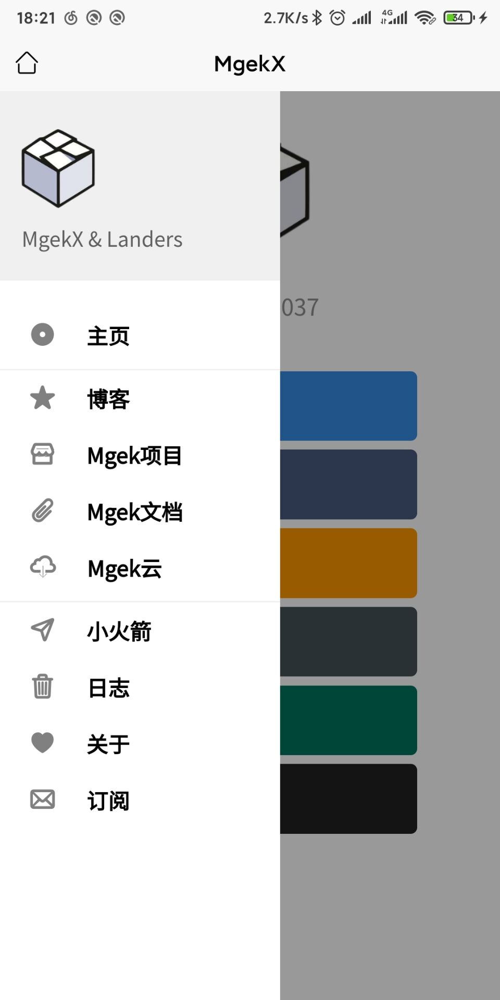
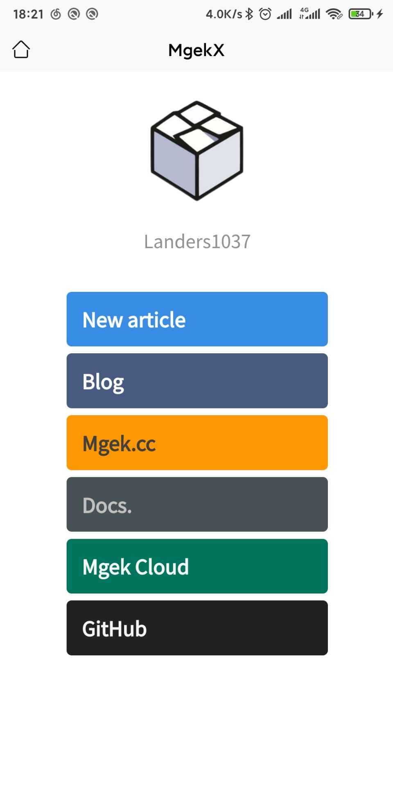
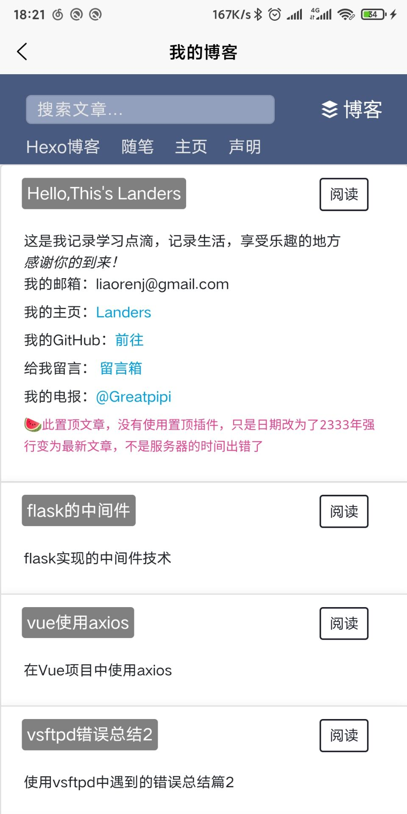

# MgekX
第一个uni-app开发的Mgek集合安卓程序，集成了博客，Mgek项目，mgek云和小火箭爬虫。支持邮件订阅和日志查询

## 平台

Android 4.0+

## 需求

uni-ui插件

## 下载

[mgekx](https://github.com/Landers1037/mgekx/releases/tag/1.0.1)

### 预览

### 目前的问题

- 订阅使用的是webview页面，必须联网打开网页，后期将改为使用api订阅
- 图标不支持使用svg图片
- 抽屉的显示与隐藏有bug，在某些特殊情况下无法触发
- 后期会加入通知功能

### 挖坑

本项目使用uni-app开发，基于vue框架。如果有时间将会使用flutter进行全新的设计。